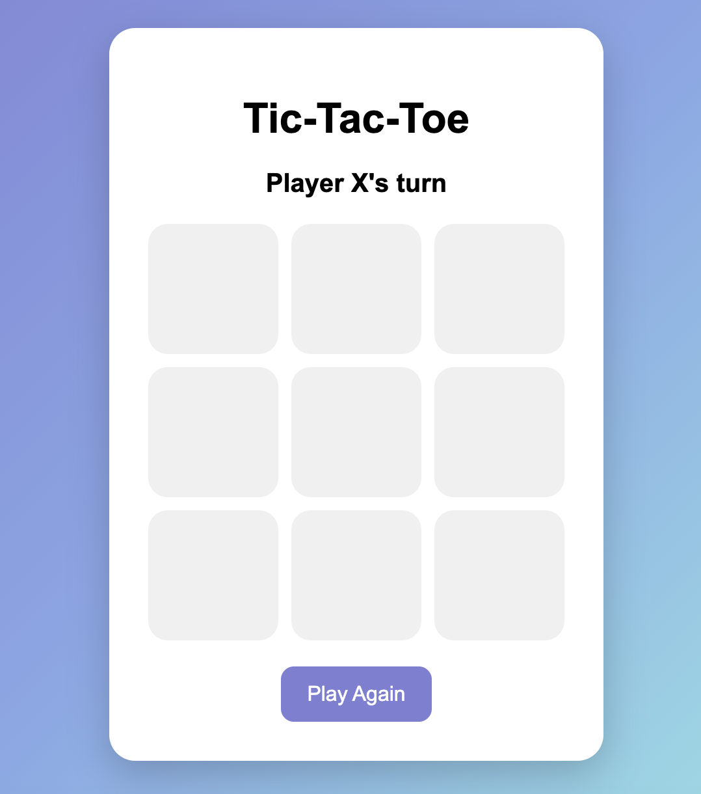
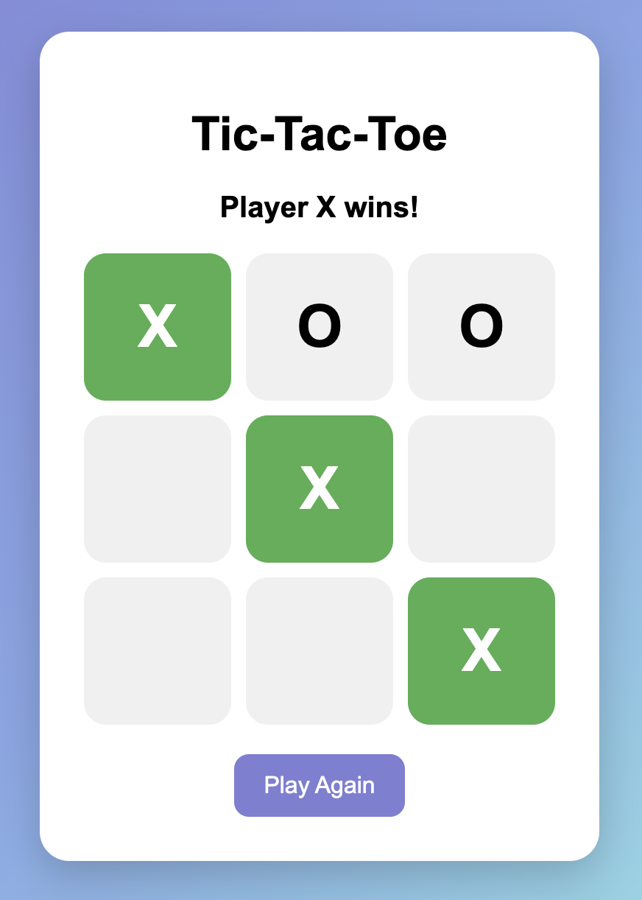

# Tic-Tac-Toe Web Game

A simple Tic-Tac-Toe game built using:

- HTML
- CSS
- JavaScript

## Features

- Two-player gameplay
- Win detection
- Draw detection
- Restart button
- Winning cell highlight

## Screenshots

### Game Board

### Winning Cells Highlighted

## How to Run

1. Download the project
2. Open index.html in your browser

## Future Improvements

- Score tracking
- AI opponent
- Animations
- Online multiplayer